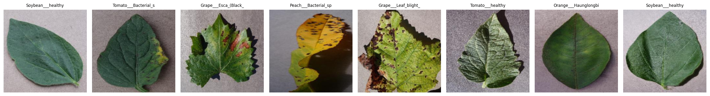
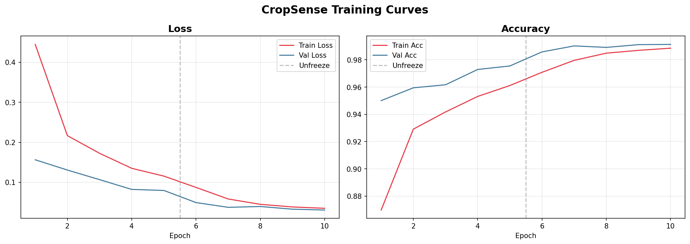
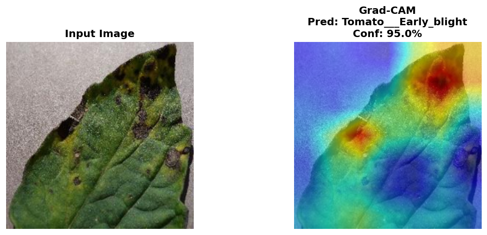
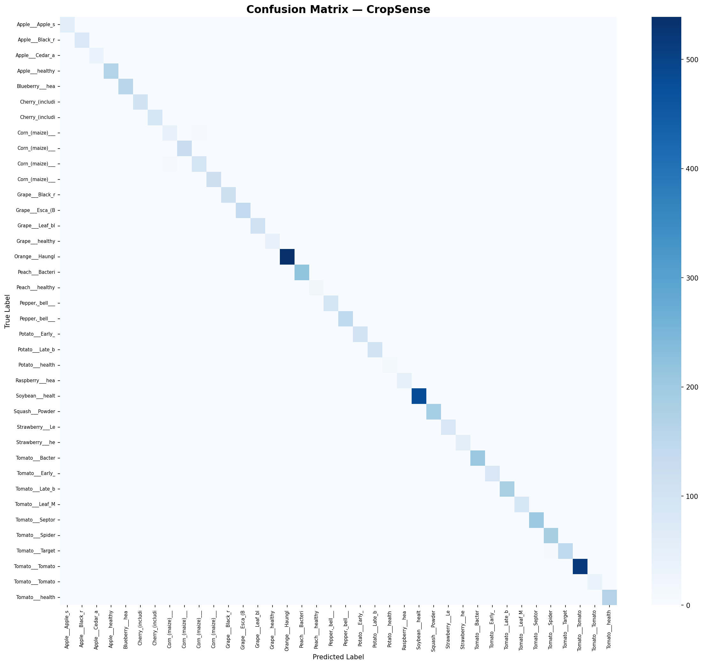

# 🌿 CropSense — AI Crop Disease Detection

> Upload a leaf photo. Get an instant diagnosis — crop type, disease name, confidence score, and a Grad-CAM heatmap showing *where* the model looked.


---

## ✨ Features

| Feature | Description |
|---|---|
| 🧠 **EfficientNetB0** | 2-phase transfer learning on PlantVillage |
| 🌾 **38 Disease Classes** | 14 crop species · 17 disease types + healthy variants |
| 🔍 **Grad-CAM** | Highlights the exact diseased region on the leaf |
| 📊 **Top-5 Predictions** | Confidence scores for top 5 diagnoses |
| 🎛️ **Gradio Web UI** | Clean editorial interface, one command launch |
| ⚡ **99.13% Val Accuracy** | Trained on 54,305 images across 38 classes |

---

## 🖥️ Interface



---

## 📊 Results

| Metric | Value |
|---|---|
| Phase 1 Best Val Accuracy | 97.55% |
| Phase 2 Best Val Accuracy | **99.13%** |
| Grad-CAM Confidence (Tomato Early Blight) | 95.0% |
| Total Training Time | ~27 mins (RTX 4060) |
| Dataset | 54,305 images · 38 classes |

---

## 📈 Training Curves



The dashed line marks the transition from Phase 1 (frozen base, lr=1e-3) to Phase 2 (full fine-tune, lr=1e-5). Validation accuracy improves from **95.01% → 99.13%** across 10 epochs.

---

## 🔍 Grad-CAM Explainability



Grad-CAM highlights the exact lesion regions the model focused on — **95.0% confidence** on Tomato Early Blight. The heatmap confirms the model is learning disease features, not background artifacts.

---

## 📉 Confusion Matrix



Strong diagonal across all 38 classes — minimal off-diagonal misclassifications, even between visually similar diseases.

---

## 🚀 Quick Start

### 1. Clone
```bash
git clone https://github.com/YOUR_USERNAME/CropSense.git
cd CropSense
```

### 2. Install
```bash
pip install -r requirements.txt
```

### 3. Download Dataset
```
https://www.kaggle.com/datasets/abdallahalidev/plantvillage-dataset
```
Extract so structure is: `data/plantvillage/<class_name>/<image>.jpg`

### 4. Train
```bash
jupyter notebook CropSense_Train.ipynb
```

### 5. Run Web App
```bash
python app.py
```
Opens at **http://localhost:7860**

---

## 🏗️ Architecture & Training

```
Input Image (224×224)
        │
        ▼
┌───────────────────────┐
│  EfficientNetB0       │  ← Pretrained ImageNet (5.3M params)
│  Feature Extractor    │
└──────────┬────────────┘
           │
           ▼
┌───────────────────────┐
│  Custom Head          │  Dropout → Linear(512) → ReLU
│                       │  → Dropout → Linear(38)
└──────────┬────────────┘
           ▼
    38-class Softmax

Phase 1: Freeze base → train head only (lr=1e-3, 5 epochs) → 97.55% val acc
Phase 2: Unfreeze all → fine-tune end-to-end (lr=1e-5, 5 epochs) → 99.13% val acc
Optimizer: AdamW + CosineAnnealingLR
```

---

## 📂 Project Structure

```
CropSense/
├── app.py                  # Gradio web application
├── CropSense_Train.ipynb   # Training + evaluation + Grad-CAM notebook
├── requirements.txt
├── class_names.json        # Generated after training
├── assets/                 # Training curves, confusion matrix, Grad-CAM
└── README.md
```

---

## 🔧 Tech Stack

`torch` · `torchvision` · `grad-cam` · `gradio` · `scikit-learn` · `matplotlib` · `seaborn`

---

## 📄 License

MIT License
